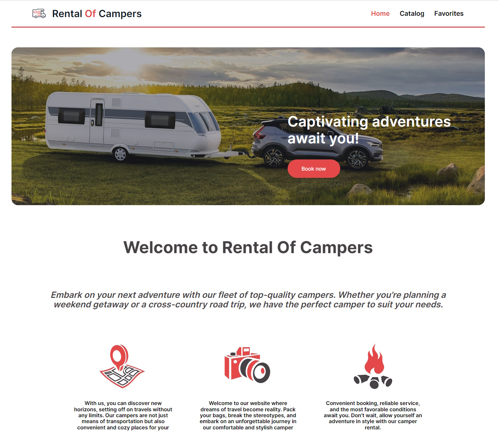
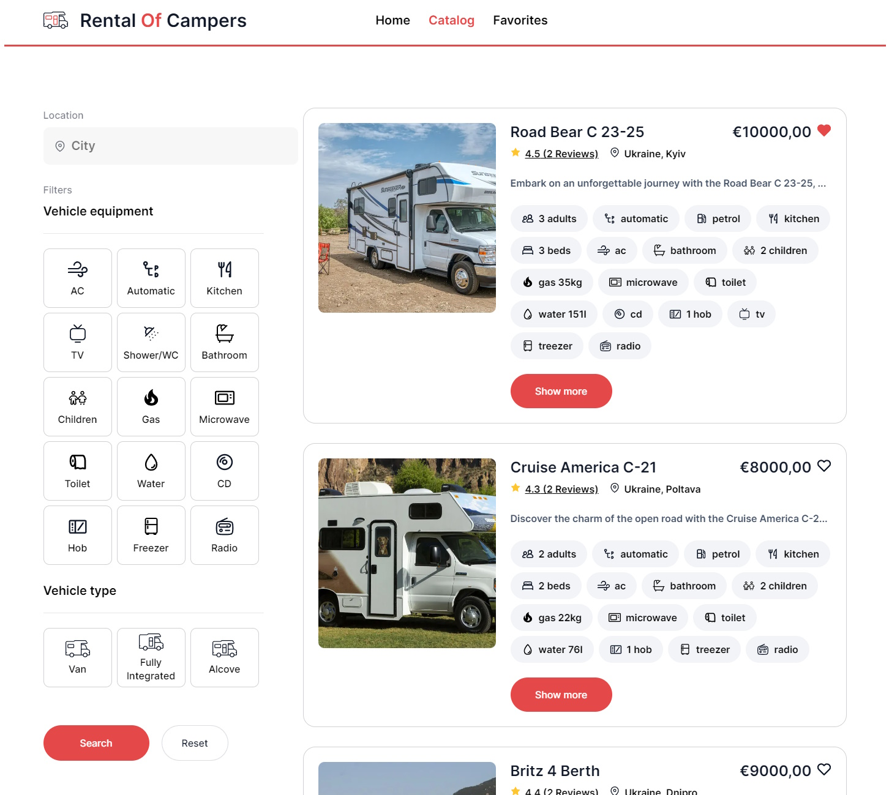

## Тестове завдання: Розробка застосунку для оренди камперів

# Опис

Розробіть веб-застосунок для компанії, що пропонує послуги оренди камперів в Україні. Застосунок має складатися з трьох основних сторінок:

1.Домашня сторінка: Загальний опис послуг компанії.
2.Каталог камперів: Сторінка з каталогом камперів, які можна фільтрувати за різними критеріями.
3.Улюблені оголошення: Сторінка з оголошеннями, які користувач додав до своїх улюблених.

# Технічні вимоги
- Реалізувати карточку оголошення про оренду кампера.
- На першій сторінці каталогу мають відображатися 4 оголошення, а решта - після натискання кнопки "Завантажити ще".
- Кнопка "Улюблене" на карточці оголошення має додавати оголошення до списку улюблених.
- При оновленні сторінки стан улюблених оголошень має зберігатися.
- Модальне вікно з детальною інформацією про кампер має відкриватися при кліку на "Докладніше".
- Модальне вікно має закриватися при натисканні на "хрестик", на фоні (backdrop) та натисканні на клавішу "Esc".
- Модальне вікно містить інформацію про кампер, відгуки, а також форму для бронювання з валідацією введених даних.
- Для роботи зі списком оголошень використовувати власний бекенд на основі https://mockapi.io/.
- Створити маршрутизацію за допомогою React Router.
- 
# Додаткові завдання
- Додати можливість фільтрації камперів за локацією, обладнанням та типом.
  
# Критерії виконання
- Семантична та валідна верстка.
- Відсутність помилок у консолі браузера.
- Використання Redux для керування станом.
- Використання Axios для здійснення запитів.
- Використання React або нативного JS з бандлером.
- Інтерактивність, як описано в технічних вимогах.
- Код без коментарів, але зрозумілий та організований.
- Наявність README.md з описом проєкту.
- Деплой проєкту на GitHub Pages або Netlify.

  
  
  
